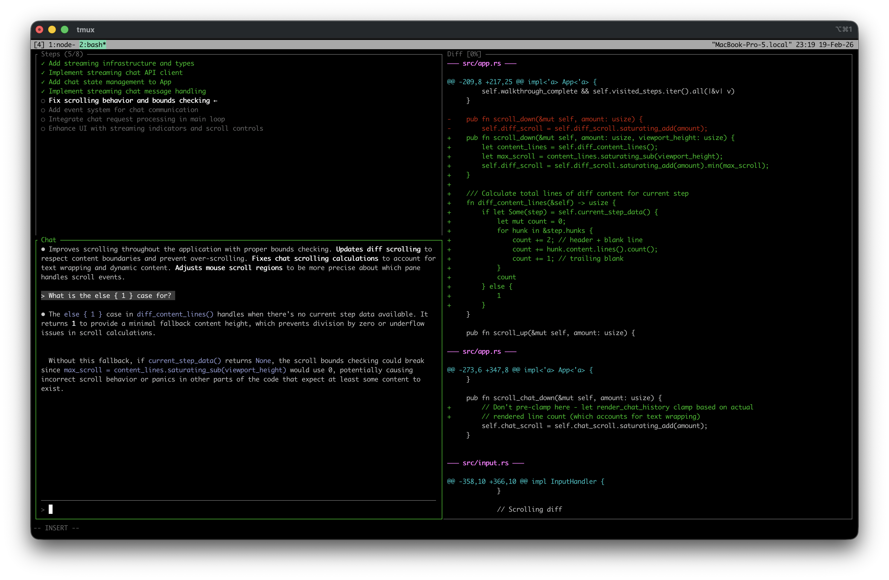

# Docent

> **Note:** This project is in early development (pre-alpha). Expect rough edges and breaking changes.

A terminal-based AI-guided code review walkthrough tool. Docent transforms raw git diffs into structured, narrative-driven walkthroughs powered by Claude AI.


*Reviewing docent in docent!*

## Why Docent?

Traditional diff viewers present changes in file order, which can be disorienting for large changesets. Docent analyzes your diff and reorganizes it into logical steps that tell the story of the changes—making code review more intuitive, especially for AI-assisted or large refactoring commits.

## Features

- **AI-Powered Walkthroughs**: Claude analyzes diffs and generates step-by-step narratives with explanations
- **Three-Pane TUI**: Minimap for navigation, explanation panel with chat, and diff viewer
- **Interactive Chat**: Ask questions about any step and get streaming responses
- **Vim-Style Navigation**: Modal editing with familiar keybindings
- **Mouse Support**: Click to select steps, drag to resize panes, scroll anywhere
- **Step Tracking**: Mark steps as reviewed and track your progress through the walkthrough

## Installation

### Prerequisites

- Rust toolchain (1.70+)
- `ANTHROPIC_API_KEY` environment variable set

### Build from source

```bash
git clone https://github.com/noahmoss/docent
cd docent
cargo build --release
```

The binary will be at `target/release/docent`.

## Usage

Pipe a git diff directly:

```bash
git diff | docent
git diff main..feature-branch | docent
```

Or pass a diff file:

```bash
docent changes.patch
```

Run with mock data for testing:

```bash
docent --mock
```

## Keybindings

| Key | Action |
|-----|--------|
| `j` / `k` | Scroll diff down/up |
| `Ctrl+d` / `Ctrl+u` | Half-page scroll |
| `gg` / `G` | Jump to top/bottom of diff |
| `n` / `p` | Next/previous step |
| `Tab` / `Shift+Tab` | Cycle through panes |
| `Enter` | Mark step complete and advance |
| `i` | Enter chat input mode |
| `Ctrl+c` | Quit |

### Mouse

- Click steps in the minimap to select
- Click the chat area to focus and enter input mode
- Drag the vertical divider to resize left/right panes
- Drag the horizontal divider to resize minimap/explanation
- Scroll wheel works in any pane

## Future Ideas

- **Syntax highlighting**: Language-aware diff highlighting for improved readability
- **GitHub integration**: Review PRs by URL and post comments directly via `gh` CLI or API
- **Branching conversations**: Start focused sub-threads to drill into specific concerns without losing your place
- **Session persistence**: Suspend and resume reviews across sessions
- **Inline edits**: Shell out to Claude Code to make changes mid-review, then continue reviewing the updated diff
- **Granularity control**: Request more or fewer steps based on review depth ("high-level overview" vs "detailed walkthrough")
- **Local LLM support**: Use Ollama or similar for offline/private reviews

## Development

```bash
cargo build           # Build the project
cargo run             # Run the TUI
cargo run -- --mock   # Run with mock data (no API needed)
cargo test            # Run tests
cargo clippy          # Run linter
cargo fmt             # Format code
```

## License

MIT
